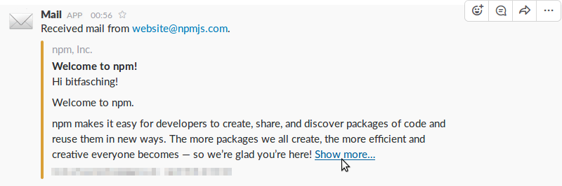

# Slack Email Webhook

A lightweight service to get notifications on [Slack](https://slack.com/) for received and sent mail.

- connects to an IMAP account and posts as [incoming webhook](https://api.slack.com/incoming-webhooks)
- can be run as multiple instances to monitor more than one mailbox
- differentiates between received and sent mail

Written in ES2015 with [async](https://developer.mozilla.org/en-US/docs/Web/JavaScript/Reference/Statements/async_function)/[await](https://developer.mozilla.org/en-US/docs/Web/JavaScript/Reference/Operators/await) from ES2017. Requires [node.js](https://nodejs.org/en/download/current/) 7.6 or newer.


## Getting Started

This is how to set up your Slack Email Webhook in 5 minutes.
You'll need:

- an email account with IMAP access
- administrative permissions for your Slack team
- a machine with a recent version of node.js to run your Slack Email Webhook (root access not required)

This service has been tested on Debian and Ubuntu, but you should be able to set up your Slack Email Webhook on any system capable of running node.js.

### Creating an Incoming Webhook

First create an incoming webhook for your Slack team.
This will give you a URL where to send your email notifications.
While logged in to your team, go to Apps › Manage › Custom Integrations › Incoming WebHooks and click [Add Configuration](https://slack.com/apps/new/A0F7XDUAZ).

Select a channel where you'd like to receive notifications and click “Add Incoming WebHooks integration”.
You'll be redirected to the configuration page of your new webhook.

Scroll down to “Integration Settings”.
Under “Post to Channel”, select where you'd like to receive notifications.
Note the field “Webhook URL” which you'll need in a minute.
You may customize the integration by naming it and setting its icon to a Slack emoji of your taste.

### Installing & Configuration

To install the [package](https://www.npmjs.com/package/slack-email-webhook) and its dependencies on your machine, change to a new directory and run [npm](https://docs.npmjs.com/):

```
$ npm install slack-email-webhook
```

You'll find a file called [`config-example.js`](config-example.js) which contains an annotated example configuration.
Create a copy and name it `config.js`, then open it in a text editor.
The following settings need to be specified before the first run:

- *username* – IMAP username, usually your email address
- *password* – password to log into your email account
- *host* – your provider's IMAP server name (if in doubt, [search](https://duckduckgo.com/?q=imap+settings+yourproviderhere) for it)
- *webhookURL* – the URL of your new integration on Slack

### Quick Run

After configuring the credentials and the webhook URL, you're ready to start the service:

```
$ npm start

> slack-email-webhook@0.1.0 start …
> node slack-email-webhook.js

2017-04-06 00:46 Connecting to imap.gmx.net:993…
2017-04-06 00:46 Selected mailbox "INBOX" containing 3773 mail(s).
2017-04-06 00:46 No unread mails to fetch.
```

In this example, the inbox didn't contain any unread messages.
The service will stay connected to your IMAP account and listen for updates.
A notification will be triggered for any new message.
You can send one or move one from another folder, e.g. from trash.

```
2017-04-06 00:56 Fetching 1 new mail(s)…
2017-04-06 00:56 Sent 1 notification(s) to Slack.
```



You should have received a notification in Slack!
Press Ctrl+C to stop the service:

```
2017-04-06 00:57 SIGINT, logging out…
2017-04-06 00:57 Exiting…
```

### Running Permanently

A convenient way to run the service permanently is to use some kind of process manager like [pm2](https://www.npmjs.com/package/pm2).
It's able to run your Slack Email Webhook after booting and restart it after unrecoverable runtime errors.

If you don't want to use a third-party process manager, you may as well start Slack Email Webhook manually, redirect its outputs to a log file and put it into background.
In a POSIX-compliant terminal, you could do the following:

```
$ node slack-email-webhook.js >> somename.log 2>&1 &
[1] 25978
```

You get the process' job number and its PID. To bring a process to foreground, use `fg %JOBNUMBER`. To gracefully shut down the service while it's in the background, send a SIGINT signal to its PID:

```
$ kill -INT 25978
```


## Reference

### Configuration File

The sample configuration file [`config-example.js`](config-example.js) contains comments for every setting, which should be self-explanatory.
Every key must have a valid value; they will neither be checked nor completed with defaults.
The configuration file is executed and imported as a module using node's `require()`.

### Environment Variables

Two environment variables are considered during start:

- `CONFIG`: Absolute or relative path to the configuration file. Defaults to “./config.js”.
- `MAILBOX`: Name of the mailbox to watch. Overrides the “mailbox” property in the configuration file, if set.

### Process Interface

Slack Email Webhook…

- ignores any command line arguments
- ignores any input via `stdin`
- writes informational messages to `stdout`
- writes error messages to `stderr`
- logs out and exits gracefully on `SIGINT` signal
- does not return any special exit codes

### Slack Interface


## Examples

### Exploring Available Mailboxes

Usually an IMAP account comprises several mailboxes (folders).
The mailbox for incoming mail is commonly called “INBOX”, which is the default mailbox monitored by Slack Email Webhook.
To watch another mailbox, e.g. for sent mail, either specify its name in `config.js` or pass it as environment variable `MAILBOX` when starting the service.

Mailbox names are not standardized.
It's common to store sent mails in “Sent” for example, but this name may vary from client to client, especially in non-English language environments.
Slack Email Webhook retrieves a list of existing mailboxes from the server and checks if the mailbox you wanted is available.
In case it's not, the list is shown in the log.
You may use this to explore the available mailboxes in your account:

```
$ MAILBOX=? node slack-email-webhook.js
2017-04-16 16:48 Connecting to posteo.de:993…
2017-04-16 16:48 Wanted mailbox "?" is not available.
2017-04-16 16:48 Available mailboxes: "Drafts", "Trash", "Sent", "Notes", "INBOX"
2017-04-16 16:48 Exiting…
```

### Two Instances for Received & Sent Mail

You can run multiple instances of Slack Email Webhook if you want to monitor multiple mailboxes.
A common use case would be to forward not only received, but also sent mail to Slack.

This is how you could spawn two Slack Email Webhook instances using [pm2](https://www.npmjs.com/package/pm2) to watch the mailboxes “INBOX” and “Sent” as specified by the environment variable `MAILBOX`:

```
$ MAILBOX=INBOX pm2 start slack-email-webhook.js --name="Mail to Slack: INBOX" --log=inbox.log
$ MAILBOX=Sent  pm2 start slack-email-webhook.js --name="Mail to Slack: Sent"  --log=sent.log
$ pm2 list
┌───────────────────────┬──────┬────────┬───┬─────┬───────────┐
│ Name                  │ mode │ status │ ↺ │ cpu │ memory    │
├───────────────────────┼──────┼────────┼───┼─────┼───────────┤
│ Mail to Slack: INBOX  │ fork │ online │ 0 │ 0%  │ 28.5 MB   │
│ Mail to Slack: Sent   │ fork │ online │ 0 │ 0%  │ 28.4 MB   │
└───────────────────────┴──────┴────────┴───┴─────┴───────────┘
```


## License

Slack Email Webhook can be used, shared and modified under the terms of the [AGPLv3](https://www.gnu.org/licenses/agpl-3.0.html).
